# IPS Security Center - File Structure and Architecture Documentation

## Table of Contents
1. [Data Flow Architecture](#data-flow-architecture)
2. [Project Overview](#project-overview)
3. [Root Directory Structure](#root-directory-structure)
4. [Source Code Organization](#source-code-organization)
5. [Component Architecture](#component-architecture)
6. [Service Layer](#service-layer)
7. [Type System](#type-system)
8. [Documentation Structure](#documentation-structure)

---

## Data Flow Architecture

### High-Level System Architecture

```mermaid
graph TB
    User[👤 User Interface] --> Pages[📄 Pages Layer]
    Pages --> Components[🧩 Components Layer]
    Components --> Hooks[🪝 Custom Hooks]
    Components --> Services[⚙️ Services Layer]
    Hooks --> Services
    Services --> APIs[🌐 External APIs]
    Services --> FastAPI[🚀 FastAPI Backend]
    
    subgraph "Frontend React Application"
        Pages
        Components
        Hooks
        Services
    end
    
    subgraph "Backend Services"
        FastAPI
        APIs
    end
    
    subgraph "Security Tools Ecosystem"
        APIs --> GVM[🔍 OpenVAS/GVM]
    end
    
    FastAPI --> SecurityTools[🔧 Orchestrated Security Tools]
    SecurityTools --> GVM
```



### Detailed Component Data Flow


### Data Type Flow

```mermaid
graph TD
    subgraph "Type Definitions"
        SecurityTypes[security.ts<br/>📋 Core Security Types]
        AgenticTypes[agenticPentest.ts<br/>🤖 Pentest Types]
    end
    
    subgraph "Component Layer"
        Props[⚛️ Typed Component Props]
    end
    
    subgraph "API Layer"
        APIData[📡 Typed API Responses]
    end
    
    subgraph "State Management"
        StateData[💾 Typed State Objects]
    end
    
    SecurityTypes --> Props
    AgenticTypes --> Props
    SecurityTypes --> APIData
    AgenticTypes --> APIData
    APIData --> StateData
    StateData --> Props
    
    Props --> Render[🎨 Component Rendering]
```



### Request-Response Flow Example

```mermaid
sequenceDiagram
    participant User as 👤 User
    participant Component as ⚛️ Component
    participant Hook as 🪝 Hook
    participant Service as ⚙️ Service
    participant FastAPI as 🚀 FastAPI
    participant SecurityTool as 🛡️ Security Tool
    
    User->>Component: Trigger Action (e.g., Start Scan)
    Component->>Hook: Call Hook Function
    Hook->>Service: API Request
    Service->>FastAPI: HTTP Request
    FastAPI->>SecurityTool: Execute Security Task
    SecurityTool-->>FastAPI: Tool Response
    FastAPI-->>Service: API Response
    Service-->>Hook: Processed Data
    Hook-->>Component: Update State
    Component-->>User: UI Update
```



### Real-Time Data Flow

```mermaid
graph LR
    subgraph "Frontend Layer"
        Component[⚛️ Security Component]
        RealtimeHook[🪝 useRealTimeSecurityData]
    end
    
    subgraph "Backend Services"
        FastAPI[🚀 FastAPI Server]
        SecurityTools[🛡️ Security Tools]
    end
    
    subgraph "Real-Time Communication"
        WebSocket[🔌 WebSocket Connection]
        Polling[⏱️ Polling Mechanism]
    end
    
    Component --> RealtimeHook
    RealtimeHook --> WebSocket
    RealtimeHook --> Polling
    WebSocket --> FastAPI
    Polling --> FastAPI
    FastAPI --> SecurityTools
    SecurityTools --> FastAPI
    FastAPI --> WebSocket
    FastAPI --> Polling
    WebSocket --> RealtimeHook
    Polling --> RealtimeHook
    RealtimeHook --> Component
```



### AI-Driven Penetration Testing Flow

```mermaid
sequenceDiagram
    participant User as 👤 Security Analyst
    participant UI as 🎨 EnhancedAgenticPentestInterface
    participant AgenticAPI as 🤖 agenticPentestApi
    participant FastAPI as 🚀 FastAPI Backend
    participant AIAgent as 🧠 AI Agent
    participant Tools as 🔧 Security Tools
    
    User->>UI: Configure Pentest Parameters
    UI->>AgenticAPI: Submit Attack Plan
    AgenticAPI->>FastAPI: POST /pentest/session
    FastAPI->>AIAgent: Initialize Agent
    
    loop Autonomous Execution
        AIAgent->>Tools: Execute Security Tests
        Tools-->>AIAgent: Test Results
        AIAgent->>AIAgent: Analyze & Decide Next Steps
        AIAgent->>FastAPI: Update Progress
        FastAPI-->>UI: Real-Time Progress Updates
        UI-->>User: Display Live Results
    end
    
    AIAgent->>FastAPI: Final Report
    FastAPI-->>AgenticAPI: Complete Results
    AgenticAPI-->>UI: Render Report
    UI-->>User: Display Comprehensive Results
```



### Security Alert Processing Flow

```mermaid
graph TB
    subgraph "Alert Sources"
        GVM[🔍 GVM Findings]
    end
    
    subgraph "Processing Pipeline"
        Aggregator[📊 Alert Aggregator]
        Correlator[🔗 Event Correlator]
        Prioritizer[⚠️ Risk Prioritizer]
        MitreMapper[🗺️ MITRE ATT&CK Mapper]
    end
    
    subgraph "Output"
        Dashboard[📈 Security Dashboard]
        Notifications[🔔 Real-Time Alerts]
        Reports[📄 Intelligent Reports]
    end
    
    GVM --> Aggregator
    
    Aggregator --> Correlator
    Correlator --> Prioritizer
    Prioritizer --> MitreMapper
    
    MitreMapper --> Dashboard
    MitreMapper --> Notifications
    MitreMapper --> Reports
```



### Configuration and Environment Flow

```mermaid
graph LR
    subgraph "Configuration Sources"
        EnvFile[📄 .env File]
        ConfigTS[⚙️ environment.ts]
    end
    
    subgraph "Validation Layer"
        EnvConfig[EnvironmentConfigStatus]
        Validator[🔍 Config Validator]
    end
    
    subgraph "Application Usage"
        Services[⚙️ API Services]
        Components[⚛️ Components]
    end
    
    EnvFile --> ConfigTS
    ConfigTS --> Validator
    Validator --> EnvConfig
    EnvConfig --> Services
    EnvConfig --> Components
    
    Services --> BackendAPIs[🌐 Backend APIs]
    Components --> UserInterface[🎨 UI Rendering]
```



---

## Project Overview

The IPS Security Center is a comprehensive React-based web application designed for offensive security operations, vulnerability assessment, and security information management. The application integrates multiple security tools and provides a unified interface for penetration testing, threat intelligence, and security monitoring.

**Technology Stack:**
- **Frontend Framework:** React 18 with TypeScript
- **Build Tool:** Vite
- **Styling:** Tailwind CSS with custom design tokens
- **UI Components:** Radix UI primitives with shadcn/ui
- **State Management:** React Query (TanStack Query)
- **Routing:** React Router DOM v6

---

## Root Directory Structure

```
/
├── docs/                          # Comprehensive project documentation
├── public/                        # Static public assets
├── src/                          # Main application source code
├── supabase/                     # Backend configuration (auto-managed)
├── .env                          # Environment variables (auto-generated)
├── eslint.config.js              # ESLint configuration
├── index.html                    # Application entry HTML
├── tailwind.config.ts            # Tailwind CSS configuration
├── tsconfig.json                 # TypeScript configuration
└── vite.config.ts               # Vite build configuration
```

### Root Configuration Files

- **`index.html`**: Main HTML entry point that loads the React application
- **`vite.config.ts`**: Vite bundler configuration for development and production builds
- **`tailwind.config.ts`**: Custom Tailwind configuration with design system tokens
- **`eslint.config.js`**: Code quality and linting rules
- **`tsconfig.json`**: TypeScript compiler options and path aliases

---

## Source Code Organization

### Directory Structure

```
src/
├── assets/                       # Static images and media files
├── components/                   # React components
│   ├── ui/                      # Reusable UI primitives (shadcn/ui)
│   └── [feature-components]     # Feature-specific components
├── config/                       # Application configuration
├── hooks/                        # Custom React hooks
├── integrations/                 # Third-party service integrations
├── lib/                         # Utility libraries and helpers
├── pages/                        # Route-level page components
├── services/                     # API client services
├── types/                        # TypeScript type definitions
├── App.tsx                       # Root application component
├── App.css                       # Global application styles
├── index.css                     # Design system and Tailwind directives
├── main.tsx                      # Application entry point
└── vite-env.d.ts                # Vite environment type declarations
```

### Core Application Files

#### `src/main.tsx`
- **Purpose:** Application bootstrap and initialization
- **Responsibilities:**
  - Mounts the React application to the DOM
  - Imports global styles
  - Initializes the root React component

#### `src/App.tsx`
- **Purpose:** Root component and application shell
- **Responsibilities:**
  - Configures React Query client for data fetching
  - Wraps application in provider components (TooltipProvider, QueryClientProvider)
  - Defines application routing structure
  - Initializes toast notification systems (Toaster and Sonner)

#### `src/index.css`
- **Purpose:** Design system foundation
- **Responsibilities:**
  - Defines CSS custom properties (design tokens)
  - Configures Tailwind CSS layers
  - Establishes color schemes (light/dark mode)
  - Sets typography and spacing scales
  - Defines animation keyframes

---

## Component Architecture

### UI Components (`src/components/ui/`)

**Purpose:** Reusable, accessible UI primitives built on Radix UI

These components form the foundational design system:

- **`accordion.tsx`**: Collapsible content sections
- **`alert.tsx`**: Status messages and notifications
- **`alert-dialog.tsx`**: Modal dialogs for confirmations
- **`avatar.tsx`**: User profile images with fallbacks
- **`badge.tsx`**: Status indicators and labels
- **`button.tsx`**: Interactive button component with variants
- **`card.tsx`**: Content container with header/body/footer
- **`checkbox.tsx`**: Boolean input control
- **`dialog.tsx`**: Modal overlay dialogs
- **`dropdown-menu.tsx`**: Contextual menu with actions
- **`input.tsx`**: Text input fields
- **`label.tsx`**: Form field labels
- **`select.tsx`**: Dropdown selection control
- **`separator.tsx`**: Visual divider lines
- **`sheet.tsx`**: Slide-out side panels
- **`switch.tsx`**: Toggle controls
- **`table.tsx`**: Tabular data display
- **`tabs.tsx`**: Tabbed interface navigation
- **`textarea.tsx`**: Multi-line text input
- **`toast.tsx`**: Temporary notification messages
- **`toaster.tsx`**: Toast notification container
- **`tooltip.tsx`**: Contextual hover information
- **`progress.tsx`**: Progress indicators
- **`slider.tsx`**: Range input controls
- **`scroll-area.tsx`**: Custom scrollable containers
- **`sidebar.tsx`**: Application sidebar navigation

**Design Pattern:** All UI components follow consistent patterns:
- Use `class-variance-authority` for variant management
- Accept `className` prop for custom styling
- Forward refs for proper DOM access
- Implement accessible keyboard navigation
- Support dark/light theme switching

### Feature Components (`src/components/`)

#### Security Management Components

**`SecurityDashboard.tsx`**
- **Purpose:** Central hub for security operations
- **Responsibilities:**
  - Displays real-time security metrics and alerts
  - Provides navigation to security tools
  - Shows system health status
  - Aggregates data from multiple security services
  - Manages dashboard widgets and layouts

**`WazuhManagement.tsx`**
- **Purpose:** SIEM (Security Information and Event Management) interface
- **Responsibilities:**
  - Manages Wazuh SIEM integration
  - Displays security events and logs
  - Configures Wazuh agents
  - Monitors security alerts
  - Provides agent health monitoring

**`WazuhSBOMManagement.tsx`**
- **Purpose:** Software Bill of Materials (SBOM) tracking
- **Responsibilities:**
  - Manages software component inventory
  - Tracks dependency vulnerabilities
  - Integrates with Wazuh vulnerability detection
  - Displays SBOM analytics

**`GVMManagement.tsx`**
- **Purpose:** Greenbone Vulnerability Management interface
- **Responsibilities:**
  - Manages OpenVAS/GVM vulnerability scans
  - Configures scan targets and tasks
  - Displays vulnerability reports
  - Schedules automated scans
  - Exports scan results

#### Penetration Testing Components

**`EnhancedAgenticPentestInterface.tsx`**
- **Purpose:** AI-powered autonomous penetration testing interface
- **Responsibilities:**
  - Configures AI-driven penetration testing sessions
  - Manages attack plan generation
  - Monitors autonomous agent activities
  - Displays real-time pentest progress
  - Integrates with multiple security tools
  - Provides natural language interaction for pentest configuration

**`IppsYChatPane.tsx`**
- **Purpose:** Interactive AI chat interface for security operations
- **Responsibilities:**
  - Provides conversational interface for security queries
  - Integrates with AI models for intelligent responses
  - Assists with penetration testing guidance
  - Offers real-time security recommendations
  - Maintains conversation context and history

**`MitreAttackMapper.tsx`**
- **Purpose:** MITRE ATT&CK framework integration
- **Responsibilities:**
  - Maps security findings to MITRE ATT&CK techniques
  - Visualizes attack patterns and tactics
  - Provides threat intelligence context
  - Links vulnerabilities to known attack methods
  - Generates threat coverage reports

#### Reporting and Configuration

**`IntelligentReportingSystem.tsx`**
- **Purpose:** Automated security report generation
- **Responsibilities:**
  - Aggregates data from multiple security tools
  - Generates comprehensive security reports
  - Provides customizable report templates
  - Exports reports in multiple formats (PDF, HTML, JSON)
  - Schedules automated report generation
  - Applies AI-powered analysis and recommendations

**`AgentConfigurationAdvanced.tsx`**
- **Purpose:** Advanced AI agent configuration
- **Responsibilities:**
  - Configures AI agent parameters and behaviors
  - Sets up model selection and API endpoints
  - Manages agent personas and capabilities
  - Defines agent execution rules and constraints
  - Configures tool integrations for agents

**`DocumentationLibrary.tsx`**
- **Purpose:** Centralized documentation access
- **Responsibilities:**
  - Displays project documentation
  - Provides searchable documentation interface
  - Organizes technical guides and references
  - Shows API specifications and integration guides
  - Offers quick access to methodology documents

#### Status and Monitoring

**`ConnectionStatusIndicator.tsx`**
- **Purpose:** Real-time service connection monitoring
- **Responsibilities:**
  - Displays connection status for all integrated services
  - Shows color-coded health indicators
  - Provides detailed connection diagnostics
  - Alerts on service failures
  - Offers reconnection controls

**`EnvironmentConfigStatus.tsx`**
- **Purpose:** Environment configuration validation
- **Responsibilities:**
  - Checks required environment variables
  - Validates service endpoint configurations
  - Displays configuration status dashboard
  - Identifies missing or invalid configurations
  - Provides configuration guidance

---

## Service Layer (`src/services/`)

The service layer provides abstracted API clients for external integrations and internal services.

### API Service Files

**`securityApi.ts`**
- **Purpose:** Core security operations API client
- **Responsibilities:**
  - General security API endpoints
  - Authentication and authorization
  - Common security data operations
  - Error handling and retries

**`agenticPentestApi.ts`**
- **Purpose:** AI-powered penetration testing API
- **Responsibilities:**
  - Manages autonomous pentest sessions
  - Submits attack plans to AI agents
  - Retrieves pentest results and progress
  - Configures agent behaviors
  - Handles AI model interactions

**`securityServicesApi.ts`**
- **Purpose:** Integration with external security tools
- **Responsibilities:**
  - Wazuh SIEM API interactions
  - GVM/OpenVAS vulnerability scanning
  - ZAP proxy management
  - Service health checks

**`enhancedSecurityService.ts`**
- **Purpose:** Advanced security analytics and operations
- **Responsibilities:**
  - Advanced threat analysis
  - Security data aggregation
  - Risk scoring and prioritization
  - Correlation of security events
  - Predictive security analytics

**`ipsstcApi.ts`**
- **Purpose:** IPS Security Threat Center API
- **Responsibilities:**
  - Threat intelligence feeds
  - Ticketing system integration
  - Attack plan management
  - Security incident tracking

**`openaiService.ts`**
- **Purpose:** OpenAI integration for AI capabilities
- **Responsibilities:**
  - AI model interactions
  - Natural language processing
  - Intelligent recommendations
  - Report generation assistance

**`fastApiClient.ts`**
- **Purpose:** FastAPI backend communication
- **Responsibilities:**
  - Backend API client configuration
  - Request/response handling
  - Authentication token management
  - Error handling and retries

---

## Type System (`src/types/`)

TypeScript type definitions ensure type safety across the application.

**`security.ts`**
- **Purpose:** Core security domain types
- **Definitions:**
  - `ServiceConfig`: Security service configuration
  - `ConnectionStatus`: Service connectivity status
  - `WazuhStatus`, `GVMStatus`, `ZAPStatus`: Service-specific statuses
  - `SecurityAlert`: Security event/alert structure
  - `WazuhAgent`: Wazuh agent properties
  - `ScanConfig`: Vulnerability scan configuration
  - `ScanResult`: Scan outcome data
  - `Finding`: Individual vulnerability finding
  - `GvmTarget`, `GvmTask`: GVM-specific types

**`agenticPentest.ts`**
- **Purpose:** AI penetration testing types
- **Definitions:**
  - Agent configuration structures
  - Pentest session data
  - Attack plan schemas
  - Agent response formats
  - Tool integration interfaces

---

## Custom Hooks (`src/hooks/`)

**`useSecurityStatus.ts`**
- **Purpose:** Security service connection management
- **Functionality:**
  - Monitors all security service connections
  - Provides health status indicators
  - Implements automatic retry logic
  - Exposes connection state to components

**`useRealTimeSecurityData.ts`**
- **Purpose:** Real-time security data streaming
- **Functionality:**
  - Establishes WebSocket connections
  - Subscribes to real-time security events
  - Handles data updates and notifications
  - Manages connection lifecycle

**`use-mobile.tsx`**
- **Purpose:** Responsive design detection
- **Functionality:**
  - Detects mobile/tablet viewport sizes
  - Provides responsive breakpoint hooks
  - Enables conditional mobile rendering

**`use-toast.ts`**
- **Purpose:** Toast notification management
- **Functionality:**
  - Creates and manages toast notifications
  - Handles toast queue and lifecycle
  - Provides success/error/info toast helpers

---

## Configuration (`src/config/`)

**`environment.ts`**
- **Purpose:** Centralized environment configuration
- **Responsibilities:**
  - Loads and validates environment variables
  - Provides typed configuration access
  - Defines default values
  - Exports configuration constants

---

## Utilities (`src/lib/`)

**`utils.ts`**
- **Purpose:** General utility functions
- **Functions:**
  - `cn()`: Tailwind class name merger
  - Common helper functions
  - Type guards and validators

**`gvmTransformers.ts`**
- **Purpose:** GVM data transformation utilities
- **Functions:**
  - Transforms GVM XML/API responses to application types
  - Normalizes vulnerability severity levels
  - Formats scan results for display
  - Converts between GVM and internal data structures

---

## Pages (`src/pages/`)

Page components represent distinct routes in the application.

**`Index.tsx`**
- **Route:** `/`
- **Purpose:** Application homepage and main dashboard
- **Content:** Security overview, quick actions, system status

**`WazuhManagement.tsx`**
- **Route:** `/wazuh`
- **Purpose:** Dedicated Wazuh SIEM management page
- **Content:** Full-featured Wazuh interface

**`GVMManagement.tsx`**
- **Route:** `/gvm`
- **Purpose:** Dedicated GVM vulnerability management page
- **Content:** Scan management, vulnerability reports

**`SystemStatus.tsx`**
- **Route:** `/status`
- **Purpose:** System health and diagnostics
- **Content:** Service statuses, system metrics, logs

**`NotFound.tsx`**
- **Route:** `*` (catch-all)
- **Purpose:** 404 error page
- **Content:** User-friendly error message with navigation

---

## Documentation Structure (`docs/`)

The project maintains comprehensive documentation for various stakeholders:

### Technical Documentation

- **`TECHNICAL_ARCHITECTURE.md`**: System architecture overview
- **`DEVELOPER_SETUP.md`**: Development environment setup guide
- **`API_SPECIFICATIONS.md`**: API endpoint documentation
- **`BACKEND_DEVELOPER_GUIDE.md`**: Backend development guidelines
- **`FASTAPI_MIGRATION_GUIDE.md`**: Migration strategy for FastAPI backend

### Integration Guides

- **`WAZUH_SIEM_MANAGEMENT_GUIDE.md`**: Wazuh integration documentation
- **`WAZUH_SBOM_INTEGRATION_GUIDE.md`**: SBOM tracking setup
- **`WAZUH_SBOM_API_REFERENCE.md`**: SBOM API reference
- **`THIRD_PARTY_INTEGRATIONS.md`**: External service integration guide
- **`LOCAL_MODEL_DEPLOYMENT_GUIDE.md`**: Local AI model deployment

### Security and Methodology

- **`SECURITY_ANALYSIS.md`**: Security posture analysis
- **`OFFENSIVE_SECURITY_METHODOLOGY.md`**: Penetration testing methodology
- **`TICKETING_AND_ATTACK_PLANS_GUIDE.md`**: Attack planning documentation

### Configuration and AI

- **`AI_AGENT_CONFIGURATION_GUIDE.md`**: AI agent setup and configuration
- **`REPORTING_SYSTEM_BACKEND_GUIDE.md`**: Report generation backend guide

### Quality Assurance

- **`QA_REPORT.md`**: Quality assurance test results

---

## Data Flow Architecture

### Component Hierarchy

```
App (Root)
├── QueryClientProvider (React Query)
├── TooltipProvider (Radix UI)
├── Toaster (Toast notifications)
├── Sonner (Alternative toast system)
└── BrowserRouter (Routing)
    └── Routes
        ├── Index (Dashboard)
        │   └── SecurityDashboard
        │       ├── GVMManagement
        │       ├── EnhancedAgenticPentestInterface
        │       ├── IntelligentReportingSystem
        │       └── MitreAttackMapper
        ├── GVMManagement (Dedicated page)
        ├── SystemStatus
        └── NotFound (404)
```

### Service Integration Flow

```
UI Components
    ↓
Custom Hooks (useSecurityStatus, useRealTimeSecurityData)
    ↓
Service Layer (API clients)
    ↓
External Services (Wazuh, GVM, ZAP, AI APIs)
```

### State Management Pattern

- **Local State:** `useState` for component-specific state
- **Server State:** React Query for API data caching and synchronization
- **Real-time State:** WebSocket subscriptions via custom hooks
- **Form State:** React Hook Form for complex form management

---

## Design System

### Theme Configuration

The design system is defined in `src/index.css` and `tailwind.config.ts`:

- **Color Tokens:** HSL-based semantic color variables
- **Typography:** Custom font scales and weights
- **Spacing:** Consistent spacing scale
- **Animations:** Predefined animation utilities
- **Dark Mode:** Built-in dark/light theme support

### Component Styling Strategy

1. **Semantic Tokens:** All components use CSS custom properties
2. **Variant-based:** Components use `class-variance-authority` for variants
3. **Composable:** Small, focused components that compose together
4. **Accessible:** ARIA attributes and keyboard navigation
5. **Responsive:** Mobile-first responsive design

---

## Build and Deployment

### Development

```bash
npm run dev    # Start Vite dev server
```

### Production

```bash
npm run build  # Build optimized production bundle
npm run preview # Preview production build locally
```

### Environment Variables

Required environment variables (auto-managed by Lovable Cloud):
- `VITE_SUPABASE_URL`: Backend API URL
- `VITE_SUPABASE_PUBLISHABLE_KEY`: Public API key
- `VITE_SUPABASE_PROJECT_ID`: Project identifier

---

## Key Architectural Decisions

### 1. Component-Based Architecture
- **Rationale:** Promotes reusability and maintainability
- **Implementation:** Small, focused components with single responsibilities

### 2. Service Layer Abstraction
- **Rationale:** Decouples UI from external APIs
- **Implementation:** Dedicated service files for each integration

### 3. Type-Safe Development
- **Rationale:** Prevents runtime errors and improves developer experience
- **Implementation:** Comprehensive TypeScript types for all data structures

### 4. Design System First
- **Rationale:** Ensures consistent UI/UX across the application
- **Implementation:** Semantic tokens and reusable UI primitives

### 5. Real-Time Capabilities
- **Rationale:** Security operations require immediate data updates
- **Implementation:** WebSocket subscriptions and React Query for live data

---

## Future Considerations

### Planned Enhancements

1. **Backend Migration:** Transition to FastAPI backend (see `FASTAPI_MIGRATION_GUIDE.md`)
2. **Enhanced AI Integration:** Expand autonomous agent capabilities
3. **Advanced Reporting:** More sophisticated report templates and AI analysis
4. **Multi-Tenancy:** Support for multiple organizations/teams
5. **Compliance Frameworks:** Integration with security compliance standards

### Scalability Considerations

- **Code Splitting:** Implement route-based code splitting
- **Performance Optimization:** Lazy loading of heavy components
- **State Management:** Consider Redux or Zustand for complex state
- **Testing:** Expand unit and integration test coverage

---

## Conclusion

The IPS Security Center follows modern React development best practices with a focus on:
- **Modularity:** Clear separation of concerns
- **Type Safety:** Comprehensive TypeScript coverage
- **Maintainability:** Well-organized file structure
- **Extensibility:** Easy to add new features and integrations
- **Performance:** Optimized for real-time security operations

This architecture supports the complex requirements of offensive security operations while maintaining code quality and developer productivity.
