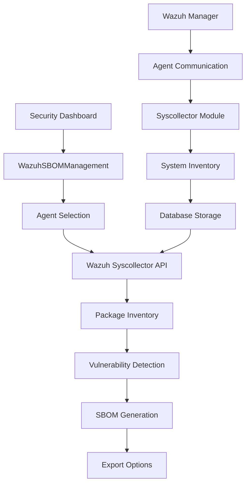

# Wazuh SBOM Integration Guide

## Overview

This guide provides comprehensive documentation for the Software Bill of Materials (SBOM) integration with Wazuh SIEM, implemented as a replacement for the traditional agent status view. The system leverages Wazuh's Syscollector module to generate comprehensive software inventories with vulnerability correlation.

## Architecture

### Components

1. **WazuhSBOMManagement.tsx** - Main SBOM management interface
2. **SecurityDashboard.tsx** - Updated dashboard with SBOM integration
3. **Wazuh Syscollector API** - Backend data source for package inventory
4. **Vulnerability Detection Module** - CVE correlation engine

### Integration Flow



## Features

### 1. Agent-Based SBOM Generation

- **Multi-Agent Support**: Generate SBOMs for any active Wazuh agent
- **Real-Time Data**: Leverage live syscollector data from monitored endpoints
- **Multiple Formats**: Support for CycloneDX, SPDX, and Wazuh native formats

### 2. Package Inventory Management

- **Comprehensive Detection**: Identifies packages across multiple formats (RPM, DEB, MSI, PKG)
- **Metadata Collection**: Vendor, version, architecture, description, install time
- **Search and Filter**: Advanced filtering capabilities for package discovery

### 3. Vulnerability Correlation

- **CVE Integration**: Automatic correlation with Common Vulnerabilities and Exposures
- **Severity Classification**: Critical, High, Medium, Low risk categorization
- **CVSS Scoring**: Industry-standard vulnerability scoring
- **Remediation Guidance**: Fixed version recommendations

### 4. Export Capabilities

- **Multiple Formats**: JSON, CycloneDX XML, CSV exports
- **Industry Standards**: Compliance with SBOM standards
- **Integration Ready**: Compatible with Dependency-Track and other tools

## API Integration

### Wazuh Syscollector Endpoints

The system integrates with the following Wazuh API endpoints:

#### 1. Agent Package Inventory
```bash
GET /agents/{agent_id}/packages
```

**Purpose**: Retrieve comprehensive package list from agent
**Authentication**: JWT Bearer token required
**Response**: Package inventory with metadata

#### 2. Agent Hardware Information
```bash
GET /agents/{agent_id}/hardware
```

**Purpose**: System hardware details for SBOM metadata
**Response**: CPU, memory, architecture information

#### 3. Agent Operating System Details
```bash
GET /agents/{agent_id}/os
```

**Purpose**: Operating system information
**Response**: OS name, version, platform details

#### 4. Vulnerability Detection
```bash
GET /vulnerability
```

**Purpose**: Vulnerability database queries
**Parameters**: CVE filters, severity levels
**Response**: Vulnerability details with CVSS scores

### Example API Implementation

```typescript
// Wazuh SBOM Service Integration
class WazuhSBOMService {
  private apiClient: WazuhAPIClient;
  
  async generateSBOM(agentId: string, format: 'cyclonedx' | 'spdx' | 'wazuh-native'): Promise<SBOMData> {
    // 1. Fetch agent packages
    const packages = await this.apiClient.get(`/agents/${agentId}/packages`);
    
    // 2. Fetch system information
    const systemInfo = await Promise.all([
      this.apiClient.get(`/agents/${agentId}/hardware`),
      this.apiClient.get(`/agents/${agentId}/os`)
    ]);
    
    // 3. Correlate vulnerabilities
    const vulnerabilities = await this.correlateVulnerabilities(packages);
    
    // 4. Generate SBOM
    return this.formatSBOM(packages, systemInfo, vulnerabilities, format);
  }
  
  private async correlateVulnerabilities(packages: PackageInfo[]): Promise<VulnerabilityInfo[]> {
    const vulnerabilities = [];
    
    for (const pkg of packages) {
      const vulns = await this.apiClient.get(`/vulnerability`, {
        params: { package: pkg.name, version: pkg.version }
      });
      vulnerabilities.push(...vulns.data);
    }
    
    return vulnerabilities;
  }
}
```

## Configuration

### 1. Wazuh Manager Configuration

Enable Syscollector module in `/var/ossec/etc/ossec.conf`:

```xml
<wodle name="syscollector">
  <disabled>no</disabled>
  <interval>1h</interval>
  <scan_on_start>yes</scan_on_start>

  <!-- System packages -->
  <packages>yes</packages>
  
  <!-- Operating system -->
  <os>yes</os>
  
  <!-- Hardware inventory -->
  <hardware>yes</hardware>
  
  <!-- Network interfaces -->
  <network>yes</network>
  
  <!-- Running processes -->
  <processes>yes</processes>
  
  <!-- Open ports -->
  <ports all="no">yes</ports>
</wodle>
```

### 2. Vulnerability Detection Configuration

Enable vulnerability detection in the same configuration file:

```xml
<vulnerability-detection>
  <enabled>yes</enabled>
  <interval>5m</interval>
  <min_full_scan_interval>6h</min_full_scan_interval>
  <run_on_start>yes</run_on_start>

  <!-- Ubuntu/Debian -->
  <provider name="canonical">
    <enabled>yes</enabled>
    <os>trusty</os>
    <os>xenial</os>
    <os>bionic</os>
    <os>focal</os>
    <os>jammy</os>
    <update_interval>1h</update_interval>
  </provider>

  <!-- RedHat/CentOS -->
  <provider name="redhat">
    <enabled>yes</enabled>
    <os>5</os>
    <os>6</os>
    <os>7</os>
    <os>8</os>
    <os>9</os>
    <update_interval>1h</update_interval>
  </provider>

  <!-- Microsoft Windows -->
  <provider name="msu">
    <enabled>yes</enabled>
    <update_interval>1h</update_interval>
  </provider>
</vulnerability-detection>
```

### 3. Agent Configuration

Configure agents to collect comprehensive inventory:

```xml
<!-- Agent ossec.conf -->
<client_buffer>
  <disabled>no</disabled>
  <queue_size>5000</queue_size>
  <events_per_second>500</events_per_second>
</client_buffer>

<wodle name="syscollector">
  <disabled>no</disabled>
  <interval>1h</interval>
  <scan_on_start>yes</scan_on_start>
  <hardware>yes</hardware>
  <os>yes</os>
  <network>yes</network>
  <packages>yes</packages>
  <ports all="no">yes</ports>
  <processes>yes</processes>
</wodle>
```

## Usage Guide

### 1. Generating an SBOM

1. **Open Security Dashboard**: Navigate to the main security dashboard
2. **Access SBOM Management**: Click the "SBOM Management" button
3. **Select Agent**: Choose target agent from dropdown
4. **Choose Format**: Select desired SBOM format (CycloneDX, SPDX, Wazuh Native)
5. **Generate**: Click "Generate SBOM" to start the process
6. **Monitor Progress**: Watch the progress bar for completion status

### 2. Reviewing Package Inventory

1. **Navigate to Packages Tab**: View comprehensive package list
2. **Search Packages**: Use search functionality to find specific packages
3. **Filter by Criteria**: Apply filters based on package attributes
4. **View Details**: Examine package metadata including version, vendor, architecture

### 3. Analyzing Vulnerabilities

1. **Access Vulnerabilities Tab**: Review security vulnerabilities
2. **Filter by Severity**: Focus on critical, high, medium, or low severity issues
3. **Review CVE Details**: Examine vulnerability descriptions and CVSS scores
4. **Check Remediation**: Identify fixed versions and mitigation strategies

### 4. Exporting SBOMs

1. **Go to Export Tab**: Access export functionality
2. **Choose Format**: Select JSON, CycloneDX XML, or CSV format
3. **Download**: Click desired format for immediate download
4. **Integration**: Use exported files with security tools like Dependency-Track

## Best Practices

### 1. Regular SBOM Generation

- **Scheduled Scans**: Set up regular SBOM generation schedules
- **Change Detection**: Generate new SBOMs after system changes
- **Version Control**: Maintain historical SBOM versions for comparison

### 2. Vulnerability Management

- **Continuous Monitoring**: Regular vulnerability scans
- **Prioritization**: Focus on critical and high-severity issues first
- **Patch Management**: Track remediation progress

### 3. Integration Workflows

- **CI/CD Integration**: Include SBOM generation in deployment pipelines
- **Compliance Reporting**: Use SBOMs for regulatory compliance
- **Supply Chain Security**: Monitor third-party component risks

## Troubleshooting

### Common Issues

#### 1. No Package Data Available

**Problem**: SBOM generation shows no packages
**Causes**:
- Syscollector module disabled
- Agent not communicating with manager
- Insufficient permissions

**Solutions**:
```bash
# Check agent status
/var/ossec/bin/wazuh-control status

# Verify syscollector configuration
grep -A 10 "syscollector" /var/ossec/etc/ossec.conf

# Force inventory scan
/var/ossec/bin/wazuh-control restart
```

#### 2. Vulnerability Correlation Failures

**Problem**: No vulnerabilities detected for known vulnerable packages
**Causes**:
- Vulnerability detection module disabled
- CVE database not updated
- Package version mismatch

**Solutions**:
```bash
# Check vulnerability detection status
grep -A 20 "vulnerability-detection" /var/ossec/etc/ossec.conf

# Force vulnerability database update
/var/ossec/bin/manage_agents -u

# Review vulnerability logs
tail -f /var/ossec/logs/ossec.log | grep vulnerability
```

#### 3. API Connection Issues

**Problem**: Cannot connect to Wazuh API
**Causes**:
- API service not running
- Authentication failures
- Network connectivity issues

**Solutions**:
```bash
# Check API service status
systemctl status wazuh-manager

# Test API connectivity
curl -u wazuh:wazuh -k -X GET "https://localhost:55000/"

# Review API logs
tail -f /var/ossec/logs/api.log
```

## Integration with Third-Party Tools

### Dependency-Track Integration

Dependency-Track is an open-source platform for analyzing SBOMs:

```bash
# Import SBOM into Dependency-Track
curl -X POST "http://dependency-track:8080/api/v1/bom" \
  -H "X-Api-Key: your-api-key" \
  -H "Content-Type: multipart/form-data" \
  -F "project=your-project-uuid" \
  -F "bom=@sbom-cyclonedx.xml"
```

### CI/CD Pipeline Integration

Example GitHub Actions workflow:

```yaml
name: SBOM Generation and Analysis

on:
  push:
    branches: [ main ]
  schedule:
    - cron: '0 2 * * *'  # Daily at 2 AM

jobs:
  sbom-analysis:
    runs-on: ubuntu-latest
    steps:
      - name: Generate SBOM from Wazuh
        run: |
          # Call Wazuh SBOM API
          curl -X POST "${{ secrets.WAZUH_API_URL }}/sbom/generate" \
            -H "Authorization: Bearer ${{ secrets.WAZUH_TOKEN }}" \
            -d '{"agent_id": "001", "format": "cyclonedx"}' \
            -o sbom.xml
      
      - name: Upload to Dependency-Track
        run: |
          curl -X POST "${{ secrets.DEPENDENCY_TRACK_URL }}/api/v1/bom" \
            -H "X-Api-Key: ${{ secrets.DEPENDENCY_TRACK_KEY }}" \
            -F "project=${{ secrets.PROJECT_UUID }}" \
            -F "bom=@sbom.xml"
```

## Security Considerations

### 1. API Security

- **Authentication**: Use strong JWT tokens with appropriate expiration
- **Authorization**: Implement role-based access control (RBAC)
- **Transport Security**: Always use HTTPS/TLS for API communication

### 2. Data Protection

- **Sensitive Information**: Filter sensitive data from SBOMs
- **Access Control**: Restrict SBOM access to authorized personnel
- **Audit Logging**: Log all SBOM generation and access activities

### 3. Vulnerability Management

- **Timely Updates**: Keep vulnerability databases current
- **False Positive Handling**: Implement processes for managing false positives
- **Risk Assessment**: Contextualize vulnerabilities based on environment

## Performance Optimization

### 1. Syscollector Tuning

```xml
<!-- Optimized syscollector configuration -->
<wodle name="syscollector">
  <disabled>no</disabled>
  <interval>6h</interval>  <!-- Reduce frequency for large environments -->
  <scan_on_start>no</scan_on_start>  <!-- Disable for faster startup -->
  
  <!-- Enable only required scans -->
  <packages>yes</packages>
  <os>yes</os>
  <hardware>no</hardware>  <!-- Disable if not needed -->
  <network>no</network>
  <processes>no</processes>
  <ports all="no">no</ports>
</wodle>
```

### 2. Database Optimization

```sql
-- Index optimization for package queries
CREATE INDEX idx_packages_agent_name ON packages(agent_id, name);
CREATE INDEX idx_vulnerabilities_package ON vulnerabilities(package_name);
CREATE INDEX idx_vulnerabilities_severity ON vulnerabilities(severity);
```

### 3. Caching Strategy

```typescript
// Implement caching for SBOM data
class SBOMCacheManager {
  private cache = new Map<string, { data: SBOMData; timestamp: number }>();
  private readonly TTL = 3600000; // 1 hour
  
  get(agentId: string): SBOMData | null {
    const cached = this.cache.get(agentId);
    if (cached && Date.now() - cached.timestamp < this.TTL) {
      return cached.data;
    }
    return null;
  }
  
  set(agentId: string, data: SBOMData): void {
    this.cache.set(agentId, { data, timestamp: Date.now() });
  }
}
```

## Compliance and Standards

### NIST Guidelines

The implementation follows NIST guidelines for SBOM:

- **SBOM Minimum Elements**: All required data fields included
- **Automation**: Automated generation and updates
- **Depth**: Component-level visibility with dependencies
- **Accuracy**: Real-time data from live systems

### Industry Standards

- **CycloneDX**: Full specification compliance
- **SPDX**: ISO/IEC 5962:2021 standard support
- **SWID**: Software Identification Tag compatibility

## Conclusion

The Wazuh SBOM integration provides a comprehensive solution for software inventory management and vulnerability correlation. By leveraging Wazuh's mature agent infrastructure and Syscollector module, organizations can maintain accurate, real-time software bills of materials across their entire infrastructure.

The system's design emphasizes:

1. **Automation**: Minimal manual intervention required
2. **Scalability**: Handles large-scale deployments
3. **Integration**: Compatible with existing security tools
4. **Compliance**: Meets industry standards and regulations
5. **Security**: Built with security-first principles

For additional support and advanced configurations, refer to the official Wazuh documentation and community resources.